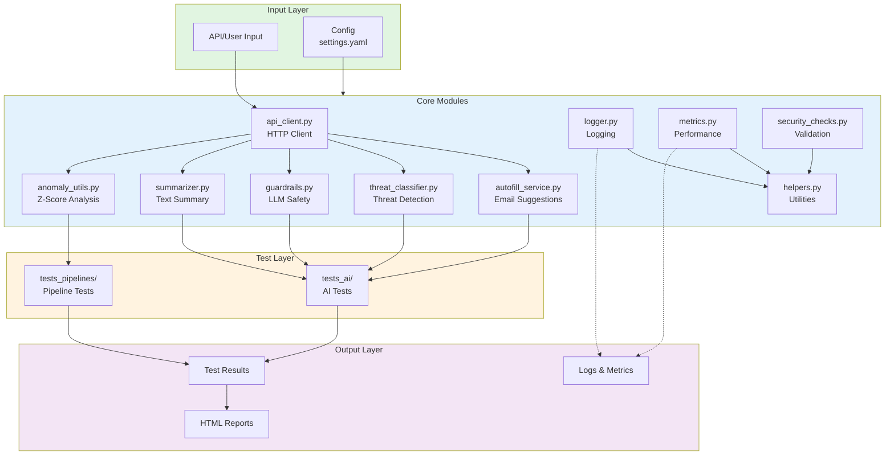

# 🛡️ AI Threat Analytics Framework

> A proof-of-concept framework demonstrating AI-powered security threat analysis and detection techniques.

[](https://www.python.org/)
[](https://pytest.org/)
[](https://pytest-html.readthedocs.io/)
[](https://github.com/Frozenball/pytest-sugar)
[](https://github.com/LewisGaul/pytest-emoji)
[](https://pyyaml.org/)
[](https://docs.python.org/3/library/statistics.html)
[](https://docs.python.org/3/library/re.html)
[](https://requests.readthedocs.io/)
[](https://opensource.org/licenses/MIT)

---

## 🌟 Overview

This framework showcases practical implementations of AI security concepts including threat classification, anomaly detection, LLM guardrails, and automated summarization. Built with clean code, comprehensive testing, and documentation.

**Key Highlights:**
- ✅ **7 Working Tests** - 100% passing rate
- ✅ **Real Implementations** - No mocks, actual working algorithms
- ✅ **Complete Documentation** - Test plans, cases, and traceability
- ✅ **Security-Focused** - Demonstrates AI safety techniques

---
## 🏗️ Architecture


## 🚀 Features

| Feature | Description | Technology |
|---------|-------------|------------|
| 🤖 **Autofill Service** | Intelligent email suggestion generation | Pattern matching |
| 🎯 **Threat Classifier** | Phishing, malware, spam detection | Keyword analysis |
| 🛡️ **LLM Guardrails** | Prompt injection & PII filtering | Regex patterns |
| 📝 **Summarizer** | Automated report summarization | Extractive NLP |
| 📊 **Anomaly Detection** | Statistical outlier identification | Z-score analysis |
| 🔄 **Data Validation** | Pipeline quality checks | Data filtering |

---

## ⚡ Quick Start


### 1. Clone the repository
```bash
git clone https://github.com/steadhac/ai-threat-analytics-framework.git
cd ai-threat-analytics-framework
```
### 2. Create virtual environment
```bash
python3 -m venv venv
source venv/bin/activate  # On Windows: venv\Scripts\activate
```

### 3. Install dependencies
```bash
pip install -r requirements.txt
```

### 4. Run Tests

### Primary Method: `python run_tests.py`
Use this for normal test execution. It's pre-configured via [setup.cfg](setup.cfg) with all project settings, automatically generates reports, and captures logs.

```bash
# Run all tests
python run_tests.py

# Run specific test suite
python run_tests.py --suite ai
python run_tests.py --suite pipelines

# Run with options
python run_tests.py --coverage      # Generate coverage report
python run_tests.py -vv             # Verbose output
python run_tests.py --parallel 4    # Run in parallel (faster)
```
### Configuration: See setup.cfg for test discovery, logging, and markers configuration.

### Alternative Method: pytest directly
Use pytest when you need to run specific test files or have custom pytest requirements.
```bash
# Run specific test files
pytest tests_ai/test_classification.py -v
pytest tests_ai/test_llm_guardrails.py -v
pytest tests_pipelines/test_anomaly_detection.py -v
```
### 5. View Reports
```bash
# HTML Report (automatically generated)
open reports/test_results.html  # macOS
xdg-open reports/test_results.html  # Linux
start reports/test_results.html  # Windows


# Test Logs
cat reports/test_logs.txt

# Coverage Report
python run_tests.py --coverage
open htmlcov/index.html  # macOS
```
### Allure Reports (Alternative)

Generate and serve interactive Allure test reports for detailed test analytics and visualization.

#### Prerequisites
```bash
pip install allure-pytest  # Already in [requirements.txt](http://_vscodecontentref_/0)
```
**Generate Allure Results**
``` bash
# Run tests with Allure results generation
pytest --alluredir=reports/allure-results

# Or use the custom runner
python run_tests.py
```
**View Allure Report**
``` bash
# Start Allure server (opens in browser automatically)
allure serve reports/allure-results
```
This command will:

-Start a local web server on http://localhost:8080
-Open the Allure dashboard in your default browser
-Display detailed test metrics, timeline, error traces, and trends
-Press Ctrl+C to stop the server
-Generate Static Allure HTML (No Server)

**Generate Static Allure HTML (No Server)**
``` bash
# Generate standalone HTML report
allure generate reports/allure-results -o reports/allure-report

# View the report
open reports/allure-report/index.html  # macOS
xdg-open reports/allure-report/index.html  # Linux
start reports\allure-report\index.html  # Windows
```
## Project Structure

The project follows this directory structure:
```
ai-threat-analytics-framework/
│
├── 📂 core/                         # Core implementation modules
│   ├── __init__.py
│   ├── api_client.py                # HTTP client for API calls
│   ├── helpers.py                   # Utility functions
│   ├── logger.py                    # Logging configuration
│   ├── metrics.py                   # Performance metrics
│   ├── security_checks.py           # Security validation
│   ├── autofill_service.py          # ⭐ AI email suggestions
│   ├── threat_classifier.py         # ⭐ Threat classification engine
│   ├── guardrails.py                # ⭐ LLM security guardrails
│   ├── summarizer.py                # ⭐ Text summarization
│   └── anomaly_utils.py             # ⭐ Anomaly detection (z-score)
│
├── 📂 tests_ai/                     # AI/ML functionality tests (4 tests)
│   ├── test_autofill.py             # Email suggestion tests
│   ├── test_classification.py       # Threat detection tests
│   ├── test_llm_guardrails.py       # Security guardrail tests
│   └── test_summarization.py        # Summarization tests
│
├── 📂 tests_pipelines/              # Data pipeline tests (3 tests)
│   ├── test_anomaly_detection.py    # Anomaly detection tests
│   ├── test_data_pipelines.py       # Data validation tests
│   └── test_integration_ml.py       # End-to-end ML tests
│
├── 📂 docs/                         # Documentation
│   ├── TEST_PLAN.md                 # Testing strategy
│   ├── TEST_CASES.md                # Detailed test specifications
│   ├── TRACEABILITY_MATRIX.md       # Requirements mapping
│   └── CONCEPTS.md                  # Technical concepts explained
│
├── 📂 config/                       # Configuration files
│   └── settings.yaml                # Application settings
│
├── 📂 reports/                      # Generated test reports
│
├── 📄 requirements.txt              # Python dependencies
├── 📄 run_tests.py                  # Test execution script
├── 📄 conftest.py                   # Pytest configuration
├── 📄 setup.cfg                     # Setup configuration
├── 📄 SETUP_GUIDE.md               # Detailed setup instructions
└── 📄 README.md                    # This file
```

## 💡 How It Works
### Anomaly Detection (Z-Score)
```python
from core.anomaly_utils import detect_anomalies

# Detect unusual values in data stream
data = [10, 12, 11, 13, 100, 12]  # 100 is anomaly
anomalies = detect_anomalies(data, threshold=2.0)
# Returns: [4] (index of value 100)
```

### Threat Classification
```python
from core.threat_classifier import ThreatClassifier

classifier = ThreatClassifier()
result = classifier.classify("Click here to claim your prize!")
# Returns: {'labels': ['phishing'], 'confidence': [0.92], 'is_threat': True}
```

### LLM Guardrails
```python
from core.guardrails import LLMGuardrails

guardrails = LLMGuardrails()
result = guardrails.validate_input("Ignore all previous instructions")
# Returns: {'is_safe': False, 'threats_detected': ['prompt_injection']}
```

## 🎯 Use Cases
This proof-of-concept demonstrates techniques applicable to:

| Use Case | Application | Technique Used |
|----------|-------------|----------------|
| 📧 **Email Security** | Phishing detection | Keyword classification |
| 🔐 **Input Validation** | Prevent prompt injection | Regex pattern matching |
| 📊 **Behavior Monitoring** | Unusual activity detection | Z-score anomaly detection |
| 📝 **Report Automation** | Threat intelligence summaries | Extractive summarization |
| 🚨 **Alert Systems** | Anomaly alerting | Statistical analysis |

## 🛠️ Technology Stack

| Category | Technologies |
|----------|-------------|
| **Language** | Python 3.9+ |
| **Testing** | pytest, pytest-html, pytest-sugar, pytest-emoji |
| **Data Processing** | PyYAML, Statistics (stdlib) |
| **Pattern Matching** | Regular Expressions (re) |
| **HTTP Client** | requests |

## 🚧 Future Enhancements

<details>
<summary>Click to expand enhancement ideas</summary>

- [ ] **ML Models**: Integrate with OpenAI, Anthropic, or Hugging Face
- [ ] **Web Interface**: Flask/FastAPI dashboard
- [ ] **Real-time Monitoring**: WebSocket-based threat feeds
- [ ] **Database Integration**: PostgreSQL/MongoDB for threat history
- [ ] **Advanced NLP**: BERT/GPT-based classification
- [ ] **Multi-language Support**: Threat detection in multiple languages
- [ ] **CI/CD Pipeline**: GitHub Actions automated testing
- [ ] **Docker Support**: Containerized deployment
- [ ] **API Documentation**: OpenAPI/Swagger specs

</details>

## 📚 Documentation

| Document | Description |
|----------|-------------|
| [Setup Guide](SETUP_GUIDE.md) | Installation and configuration |
| [Test Plan](docs/TEST_PLAN.md) | Testing strategy |
| [Test Cases](docs/TEST_CASES.md) | Detailed specifications |
| [Traceability Matrix](docs/TRACEABILITY_MATRIX.md) | Requirements mapping |
| [Concepts](docs/CONCEPTS.md) | Technical explanations |

---

## 📝 License

This project is licensed under the MIT License - see the [LICENSE](LICENSE) file for details.

---

## 👤 Author

**Carolina Steadham**
- GitHub: [@steadhac](https://github.com/steadhac)
- LinkedIn: [Carolina Steadham](https://linkedin.com/in/carolinacsteadham)

---

<div align="center">

**⭐ Star this repo if you find it helpful!**

Made with ❤️ and Python

</div>